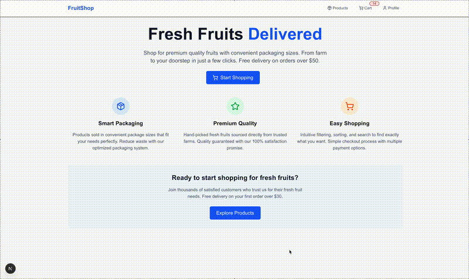

# Fruit Shop - BFF Architecture

This project implements a Backend for Frontend (BFF) pattern where the Next.js application acts as an intermediary between the frontend and the backend server.

## Architecture Overview

```
Frontend (React Components)
    ↓
Infrastructure Layer (ApiManager, Repositories)
    ↓
Next.js API Routes (BFF Layer)
    ↓
Backend Server (Port 3000)
```

## BFF Layer - API Routes

The Next.js API routes act as a BFF layer that:
1. Receives requests from the frontend
2. Forwards them to the backend server on port 3000
3. Handles errors and transforms responses if needed
4. Returns data to the frontend

### Available API Routes:

- `GET /api/products` - Get all products
- `GET /api/products/[id]` - Get specific product
- `GET /api/suggestions?searchQuery=query` - Get product suggestions
- `GET /api/cart` - Get cart contents
- `POST /api/cart` - Add item to cart
- `POST /api/cart/remove` - Remove item from cart
- `PUT /api/user/password` - Update user password

## Configuration

The backend server URL can be configured via environment variables:

```env
BACKEND_SERVER_URL=http://localhost:3000  # Default if not specified
PORT=3001  # Frontend server port
```

## Running the Application

1. Ensure your backend server is running on port 3000
2. Configure environment variables in `.env.local`
3. Start the Next.js development server: `pnpm dev`
4. The application will be available at `http://localhost:3001`

## Testing

This project includes comprehensive testing setup with Jest and React Testing Library.

### Test Structure

```
src/test/
├── setup-jest.ts              # Jest test setup and mocks
├── domain/services/           # Domain service unit tests
│   └── CartService.test.ts    # Cart calculation logic tests
├── components/                # Component integration tests
│   └── ProductCard.integration.test.tsx
└── infrastructure/repositories/ # API integration tests
    └── CartRepository.test.ts  # API client tests
```

### Running Tests

```bash
# Run all tests
pnpm test

# Run only core functionality tests (recommended)
pnpm test:core

# Run tests in watch mode
pnpm test:watch

# Run tests with coverage
pnpm test:coverage

# Run specific test file
npx jest src/test/domain/services/CartService.test.ts
```

### Test Coverage

The test suite covers:

#### CartService (15 tests)
- **calculateTotals**: Empty cart, zero quantities, decimal price handling
- **getItemQuantityInCart**: Existing/non-existing product quantity lookup
- **groupItemsByProductId**: Product grouping and quantity aggregation
- **removeItemsPartially**: Partial removal, quantity management, edge cases

#### CartRepository (15 tests)
- **getCart**: Successful responses, empty carts, API error handling
- **addToCart**: Item addition, cart updates, failure scenarios
- **removeFromCart**: Item removal, partial removal, invalid product IDs
- **Edge Cases**: Malformed responses, network timeouts, concurrent operations

#### Integration Tests
- **ProductCard**: User interactions, cart integration, accessibility compliance
- **Form Validation**: Input handling, error states, user feedback
- **API Integration**: HTTP client behavior, error scenarios, data transformation

### Test Configuration

The project uses:
- **Jest**: Testing framework with TypeScript support
- **React Testing Library**: Component testing utilities
- **jsdom**: DOM environment simulation
- **User Events**: Realistic user interaction simulation

### Mocking Strategy

Tests include comprehensive mocks for:
- Next.js router and navigation
- Next.js Image component
- Lucide React icons
- React Query client
- API HTTP client

### Best Practices

- **Unit Tests**: Focus on business logic and calculations
- **Integration Tests**: Test component behavior and user interactions
- **API Tests**: Verify HTTP client integration and error handling
- **Accessibility Testing**: Ensure WCAG 2.1 AA compliance
- **Error Scenarios**: Test edge cases and failure conditions

## SEO & Performance Features

### Static Site Generation (SSG)
- **Home Page**: Generated at build time for optimal SEO and performance
- **Structured Data**: JSON-LD schema markup for better search engine understanding
- **Meta Tags**: Comprehensive Open Graph, Twitter Card, and SEO meta tags
- **Sitemap**: Auto-generated sitemap at `/sitemap.xml`
- **Robots.txt**: SEO-friendly robots configuration

### Performance Optimizations
- **Image Optimization**: WebP/AVIF format support with responsive sizing
- **Security Headers**: CSP, HSTS, and other security headers configured
- **PWA Ready**: Web app manifest for mobile app-like experience
- **Core Web Vitals**: Optimized for Google's page experience signals

### SEO Configuration
```env
NEXT_PUBLIC_SITE_URL=https://fruitshop.com
GOOGLE_VERIFICATION_CODE=your-verification-code
```

## Benefits of BFF Pattern

1. **Security**: API keys and sensitive data can be handled server-side
2. **Request Transformation**: Can modify requests/responses for frontend needs
3. **Error Handling**: Centralized error handling and user-friendly error messages
4. **Caching**: Can implement caching strategies at the BFF level
5. **Rate Limiting**: Can implement rate limiting for backend API calls
6. **CORS Handling**: Eliminates CORS issues by proxying requests

## Domain-Driven Design (DDD)

The project follows DDD principles with:

- **Domain Layer**: Entities, Services, and business logic
- **Infrastructure Layer**: API clients, repositories, and external service integrations
- **Application Layer**: Hooks that orchestrate domain services
- **Presentation Layer**: Atomic design components (atoms, molecules, organisms)

## Atomic Design

Components are organized following atomic design principles:

- **Atoms**: Basic UI components (Button, Input, Label)
- **Molecules**: Simple component combinations (SearchBar, PasswordStrength)
- **Organisms**: Complex components (ProductCard, Header)
- **Templates**: Page layouts (AppLayout)
- **Pages**: Route-specific containers (ProductsContainer, CartContainer)

## Quick Commands

### Development
```bash
pnpm dev          # Start development server
pnpm build        # Build for production
pnpm start        # Start production server
pnpm lint         # Run ESLint
```

### Testing
```bash
pnpm test         # Run all tests
pnpm test:core    # Run core functionality tests (recommended)
pnpm test:watch   # Run tests in watch mode
pnpm test:coverage # Run tests with coverage report
```

### Environment Setup
```bash
cp .env.example .env.local  # Copy environment template
# Edit .env.local with your configuration
```
